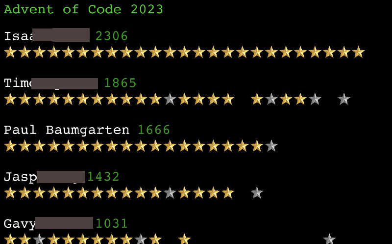

# Advent of code scoreboard

As a Computer Science teacher, I enjoy Advent of Code every year. I run a private leaderboard to let my students compete against me (nothing quite motivates like the bragging rights of beating the teacher!)

As part of the fun, I've set up a Raspberry Pi with an old monitor in my room to display this scrolling score board. Feel free to use it and adapt to your own needs. It's just a little Pygame app.

Enjoy!

Paul Baumgarten

